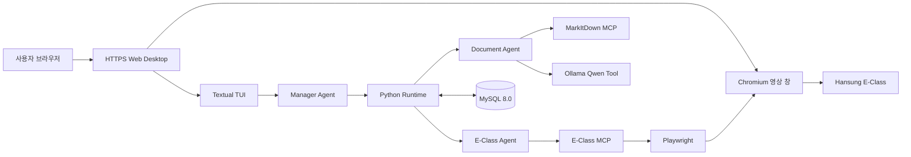

# E-Class Quest

E-Class Quest는 대학 LMS의 강좌·공지·과제·강의 상태를 확인하고, 중요한 변경과 마감을 먼저
알려 주는 로컬 실행형 Agent AI TUI입니다. 질문에 답하는 데서 끝나지 않고 검증된 LMS 데이터를
조회하며, 사용자가 요청한 강의 재생과 첨부문서 분석을 수행합니다.

현재는 **한성대학교 E-Class 어댑터를 기본 지원**합니다. 학교별 로그인 방식과 화면 구조를
처리하는 어댑터를 추가하면 다른 대학 LMS도 지원할 수 있도록 확장하는 것을 목표로 합니다.

> 중앙 서버에 계정 정보를 보내는 서비스가 아닙니다. 기본 배포 모드에서는 TUI, Agent, MCP,
> Playwright, Chromium과 MySQL이 사용자 PC의 Docker 환경에서 실행됩니다.

## 주요 기능

- 시작 시 E-Class 로그인 세션 확인 및 최신 상태 동기화
- TUI 실행 중 주기적인 공지·과제·강의 상태 확인
- 새 항목, 마감 임박 과제, 미확인 강의 능동 알림
- 자연어 기반 강좌·공지·과제·강의 조회
- 사용자가 요청한 강의 영상 재생·중지
- 과제·공지 첨부파일 다운로드와 MarkItDown 변환
- Ollama `qwen3:0.6b`를 이용한 첨부문서 구조화 분석
- 모델·API 키·E-Class 계정을 입력받는 최초 실행 마법사
- 계정과 로그인 세션의 암호화 로컬 저장

## 구조



Manager는 사용자의 의도와 작업 범위를 판단합니다. 실제 LMS 데이터와 식별자는 직접 작성한
E-Class MCP와 Playwright가 확인하며, Runtime이 허용 Tool·실행 순서·검증 상태를 통제합니다.

## 준비 사항

- Windows 10/11, macOS 또는 Linux
- Docker Desktop(Windows/macOS) 또는 Docker Engine과 Compose plugin(Linux)
- Ollama와 `qwen3:0.6b`
- OpenAI API 키

Python과 Playwright를 호스트에 별도로 설치할 필요가 없습니다. Docker 이미지가 동일한 Python
Runtime, Agent, MCP, Chromium과 필요한 라이브러리를 제공합니다. Ollama는 호스트에서 실행하며
컨테이너가 `host.docker.internal`을 통해 접근합니다. 웹 화면과 오디오는
[LinuxServer Webtop](https://docs.linuxserver.io/images/docker-webtop/)의 Selkies 기능을 사용합니다.

## 설치

```bash
git clone <repository-url>
cd <repository-directory>
ollama pull qwen3:0.6b
```

## 실행

```bash
docker compose --profile desktop up -d --build
```

이미지 빌드와 MySQL·E-Class Quest 컨테이너 시작이 끝나면 웹 브라우저에서 다음 주소를 엽니다.

```text
https://localhost:3001
```

로컬 자체 서명 인증서를 사용하므로 최초 접속 때 브라우저 경고가 표시될 수 있습니다. 로컬 주소인지
확인한 뒤 접속을 계속합니다. HTTPS 접속을 사용해야 웹 데스크톱의 영상과 소리가 정상 작동합니다.

웹 화면 안에서 다음 작업이 자동으로 진행됩니다.

1. MySQL 8.0 상태 확인
2. Alembic migration 적용
3. XFCE 터미널에서 E-Class Quest TUI 실행
4. 강의 재생 요청 시 같은 웹 데스크톱에 Chromium 창 표시
5. Chromium 소리를 HTTPS 웹 화면으로 전달

최초 실행에서는 다음 값을 입력합니다.

```text
OpenAI 모델 [gpt-5.6-terra]:
OpenAI API 키:                 # 입력 내용 숨김
E-Class 아이디:               # 입력 내용 표시
E-Class 비밀번호:             # 입력 내용 숨김
```

설정은 `data/`에 암호화해 저장되므로 컨테이너를 다시 만들어도 유지됩니다.

종료와 재실행은 다음 명령을 사용합니다.

```bash
docker compose --profile desktop stop desktop mysql
docker compose --profile desktop start mysql desktop
```

모델이나 계정을 다시 입력하려면 웹 데스크톱의 터미널에서 다음 명령을 실행합니다.

```bash
cd /app
/usr/local/bin/python -m app.main --setup
```

## 네이티브 개발 실행

Docker 이미지가 아닌 호스트 Python으로 개발할 때만 Python 3.10 이상과 Playwright Chromium을
직접 설치합니다. Windows는 `run.ps1` 또는 `run.cmd`, macOS·Linux는 `run.sh`를 사용합니다.
이 실행 방식은 개발 편의를 위해 유지하며 일반 배포의 기본 경로는 위의 Docker Desktop 모드입니다.

## 환경설정

일반 사용자는 `.env` 파일을 만들 필요가 없습니다. Docker Compose와 코드 기본값을 사용합니다.

다른 MySQL·Ollama·LMS 주소를 사용하려는 경우에만 [.env.example](./.env.example)을 복사해
필요한 항목을 변경합니다.

```bash
cp .env.example .env
```

`ECLASS_BASE_URL`은 Adapter 개발과 다른 LMS 환경 검증을 위해 변경할 수 있습니다. 다만 현재
Playwright 선택자와 파서는 한성대학교 E-Class 화면을 기준으로 작성되어 있어 URL만 바꾼다고
다른 학교 LMS가 즉시 호환되는 것은 아닙니다.

## 로컬 데이터와 보안

다음 파일은 Git에 포함되지 않습니다.

| 경로 | 내용 |
|---|---|
| `data/config/settings.json` | 선택한 OpenAI 모델 |
| `data/config/credentials.enc` | 암호화된 API 키와 E-Class 계정 |
| `data/config/.credentials.key` | 로컬 자격증명 암호화 키 |
| `data/sessions/eclass_state.enc` | 암호화된 브라우저 로그인 세션 |
| `data/downloads/` | 내려받은 E-Class 첨부파일 |
| `data/audit/` | 비밀 원문을 제외한 실행 기록 |

- API 키·비밀번호·쿠키는 Agent 입력, MySQL, TUI 출력에 포함하지 않습니다.
- OpenAI Agents SDK trace에는 민감한 입력과 Tool 결과를 포함하지 않습니다.
- 로컬 암호화는 Git 실수와 평문 노출을 방지하지만, 사용자 계정 자체가 탈취된 상황까지 방어하는
  OS 자격증명 저장소를 대신하지는 않습니다.
- `.env`, `data/`, `secrets/`는 절대 강제로 Git에 추가하지 마세요.

## 테스트

GitHub Actions는 Python 3.12 기준 Windows, macOS, Linux 세 환경에서 동일한 테스트를 실행합니다.
로컬에서는 다음 명령으로 확인합니다.

```bash
python -m unittest discover -s tests
```

Docker Compose 설정 확인:

```bash
docker compose --profile desktop config --quiet
```

## 프로젝트 구성

```text
app/                    TUI, Manager Runtime, Agent, 동기화, MySQL 저장소
mcp_server/             Playwright 기반 E-Class MCP 서버
document_mcp_server/    MarkItDown MCP 서버
alembic/                MySQL schema migration
scripts/                로그인·검증·백업·배포 보조 명령
tests/                  단위·통합·TUI 회귀 테스트
markdown/               아키텍처·로드맵·구현 설명
Dockerfile.desktop      웹 화면·오디오가 포함된 크로스 플랫폼 배포 이미지
docker-compose.yml      Desktop 앱과 MySQL 실행 정의
run.sh                  macOS·Linux·WSL 실행 파일
run.ps1, run.cmd        Windows 실행 파일
scripts/local_launcher.py  모든 OS가 공유하는 MySQL 준비·migration·TUI 런처
```

## 문제 해결

### Docker가 실행되지 않았습니다

Windows와 macOS에서는 Docker Desktop을 먼저 실행합니다. Linux에서는 Docker daemon과 현재
사용자의 Docker 권한을 확인합니다. 다음 명령에서 Client와 Server 정보가 모두 보여야 합니다.

```text
docker version
docker compose version
```

WSL에서만 Docker 연결이 끊긴 경우에는 Docker Desktop의 WSL Integration을 확인하고 PowerShell에서
다음 명령을 실행한 뒤 WSL을 다시 엽니다.

```powershell
wsl --shutdown
```

### 설정을 다시 입력하고 싶습니다

웹 데스크톱의 터미널에서 실행합니다.

```bash
cd /app
/usr/local/bin/python -m app.main --setup
```

### Playwright Chromium이 없습니다

Docker 이미지 빌드를 다시 실행합니다.

```bash
docker compose --profile desktop build --no-cache desktop
docker compose --profile desktop up -d
```

호스트 Python으로 개발하는 경우에만 다음 명령을 사용합니다.

```text
Windows:       .\.venv\Scripts\python.exe -m playwright install chromium
macOS·Linux:   ./.venv/bin/python -m playwright install chromium
```

## 문서

- [아키텍처](./markdown/Architecture.md)
- [구현 로드맵](./markdown/ROADMAP.md)
- [Agent AI 입문 가이드](./markdown/AGENT_AI_BEGINNER_GUIDE.md)
- [메인 실행 흐름](./markdown/MAIN_EXECUTION_FLOW_GUIDE.md)
- [DB 스키마 검토](./markdown/DB_SCHEMA_FINAL_REVIEW.md)
- [배포·운영 가이드](./markdown/DEPLOYMENT.md)

## 현재 범위

- Windows 10/11, macOS, Linux와 WSL에서 동일한 Docker 이미지를 사용하도록 구성되어 있습니다.
- TUI·Agent·MCP·Playwright·Chromium·MySQL은 Docker에서 실행하고, Ollama만 호스트에서 실행합니다.
- 강의 화면과 소리는 로컬 전용 `https://localhost:3001` 웹 데스크톱으로 전달합니다.
- 현재 기본 제공되는 LMS 어댑터는 한성대학교 E-Class 전용입니다.
- 다른 대학을 지원하려면 해당 LMS의 로그인·강좌·공지·과제·강의 화면에 맞는 어댑터와
  Playwright 선택자를 추가해야 합니다.
- TUI가 실행 중일 때만 주기 동기화와 능동 알림이 작동합니다.
- 24시간 백그라운드 Gateway나 별도 알림 서버는 포함하지 않습니다.
- E-Class 화면 구조가 변경되면 Playwright 선택자·파서 수정이 필요할 수 있습니다.
- OpenAI API 사용량에 따른 비용은 사용자 계정에 청구됩니다.
