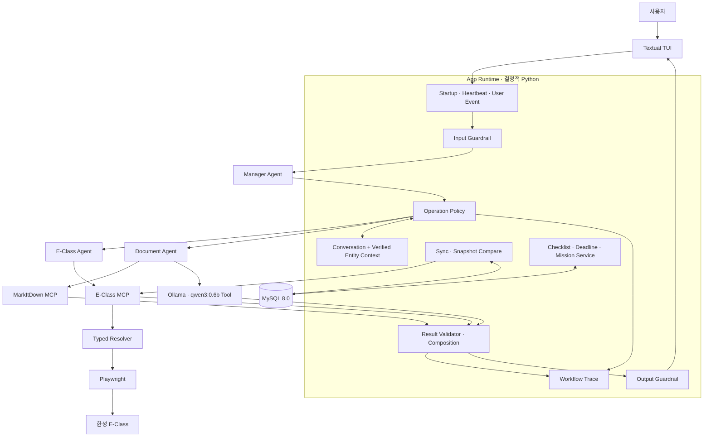

# E-Class Quest 목표 아키텍처

## 1. 서비스 목표

E-Class Quest는 질문에만 답하는 챗봇이 아니라, **TUI가 실행되는 동안 한성대학교 E-Class를
확인하고 중요한 일정과 변경을 먼저 알려 주는 능동형 LMS 비서**다.

- 시작할 때 로그인 세션을 확인하고 E-Class 최신 상태를 동기화한다.
- TUI가 켜진 동안 공지·과제·강의·출석 상태를 주기적으로 다시 확인한다.
- 새 항목과 마감 임박 항목은 이전 MySQL Snapshot과 비교해 먼저 알린다.
- 자연어 요청은 Manager가 이해하되, LMS 사실과 식별자는 MCP의 검증된 결과만 사용한다.
- TUI를 종료하면 Timer, Agent 실행과 브라우저 자원도 함께 종료한다.
- 별도 Gateway나 24시간 백그라운드 서비스는 운영하지 않는다.

Agent AI가 처음이라면 [`AGENT_AI_BEGINNER_GUIDE.md`](./AGENT_AI_BEGINNER_GUIDE.md)를 먼저 읽는다.
실제 작업 순서는 [`ROADMAP.md`](./ROADMAP.md)를 따른다.

---

## 2. 리팩터링 배경과 구현 상태를 구분하는 법

3-Agent 교정 직전 저장소에는 기능을 빠르게 연결하며 만들어진 다음 혼합 실행 경로가 있었다.

```text
Manager가 구조화 계획 생성
→ Python Runtime이 전문 Handler를 직접 선택·실행
→ E-Class 작업은 실제 E-Class Agent + MCP
→ 문서 작업은 Handler가 MarkItDown MCP + Qwen 실행
→ Mission 작업은 Handler가 MySQL Repository 실행
→ 필요하면 별도 Manager 합성 호출
```

이 경로도 실제 기능이 없는 Mock은 아니었다. 직접 작성한 Playwright 기반 E-Class MCP와 실제
Tool이 연결돼 있었지만, Agent·Handler·Runtime의 책임이 겹치고 화면 단위 Tool의 ID 연결을 모델이
일부 담당해 후속 요청과 영상 선택이 흔들릴 수 있었다.

이 문서의 나머지는 **확정한 목표 구조**를 설명한다. 실제 반영 여부는 로드맵 8.5단계의 체크를
기준으로 하며, 완료 표시되지 않은 항목은 설계가 확정됐다는 뜻이지 구현 완료라는 뜻이 아니다.

현재 핵심 교정 코드는 반영됐다. Manager는 Tool·handoff 없는 typed planner이고, 각 작업을
`entity + action + slots`로 반환한다. Runtime은 이 계약을 검증해 E-Class·Document Agent 또는
LLM 없는 Mission Service를 명시적으로 호출한다. 별도 합성 Agent는 제거됐으며, 종류별 검증
Snapshot, 요청 단위 SDK trace, 작업별 MCP Tool 허용 정책과 고수준 MCP Tool 7개가 추가됐다.
자동화 테스트는 계속 통과하도록 유지하고 있지만 실제 E-Class 다중 턴 smoke test는 아직 별도
검증 항목으로 남는다.

---

## 3. 핵심 설계 원칙

1. Agent는 판단이 필요한 역할에만 둔다.
2. 같은 입력에 같은 결과가 필요한 계산·검증·저장은 일반 Python 코드가 담당한다.
3. Agent는 총 3개만 유지한다: `Manager`, `E-Class`, `Document`.
4. Manager가 사용자 문맥과 최종 응답 정책을 소유하고, Runtime이 검증된 사실 표시를 결정적으로 조합한다.
5. E-Class와 Document는 Runtime이 필요한 경우에만 명시적으로 호출하는 제한된 specialist다.
6. SDK handoff와 `agent.as_tool()`에 실행 순서를 맡기지 않고 custom orchestration을 사용한다.
7. Manager와 E-Class Agent는 LMS의 이름·날짜·식별자·URL을 생성하거나 수정하지 않는다.
8. 과목·공지·과제·강의 연결은 확정적 resolver와 검증된 참조로 처리한다.
9. 주기 수집, Snapshot 비교, Checklist와 마감 계산에는 LLM을 사용하지 않는다.
10. 프롬프트는 역할과 판단 규칙만 담고, 과거 버그별 예외 규칙은 타입·코드·테스트로 옮긴다.
11. 입력·Tool·출력 경계에 코드 기반 Guardrail을 둔다.
12. 개발 자격증명은 git에서 제외된 `.env`, 운영 자격증명은 Secret Manager에 둔다.

핵심 문장은 다음과 같다.

> AI가 판단해야 하는 곳에는 Agent를 두고, 정확해야 하는 곳에는 코드를 둔다.

---

## 4. 전체 목표 구조



Manager가 전문 Agent를 선택하더라도 Runtime은 순서·허용 Tool·검증 상태·취소·오류를 강제한다.
따라서 이 구조는 “모델이 모든 것을 마음대로 실행”하는 구조가 아니라, **Manager가 의미를 판단하고
Runtime이 실행을 통제하는 하이브리드 구조**다.

---

## 5. Agent 구성: 총 3개

```text
Manager Agent
├─ Runtime 호출 → E-Class Agent
└─ Runtime 호출 → Document Agent
```

### 5.1 Manager Agent

Manager는 사용자 전담 비서이자 대화·작업 범위의 소유자다.

- 사용자의 요청과 구조화 시스템 이벤트를 이해한다.
- 잡담인지 실제 LMS 작업인지 구분한다.
- 각 작업의 `entity`, `action`, `slots`에 대상·동작·학기·과목·주차·번호·필터를 구조화한다.
- E-Class 또는 Document specialist가 필요한지 결정한다.
- 검증된 전문 결과와 능동 이벤트를 사용자에게 설명한다.
- TUI가 실행되는 동안 안전하게 정리한 대화 문맥을 소유한다.
- 대상이 여러 개면 임의 선택하지 않고 실제 후보로 되묻는다.

Manager가 하지 않는 일:

- LMS를 직접 탐색하거나 Playwright 선택자를 다루지 않는다.
- `course_id`, `assignment_id`, `lecture_id`를 만들거나 복사해 연결하지 않는다.
- 제출 여부, 시청률, 마감 시각을 추측하지 않는다.
- Heartbeat 시간을 세거나 DB CRUD 규칙을 판단하지 않는다.
- 별도 Synthesis Agent나 두 번째 Manager 호출에 최종 응답을 넘기지 않는다.

목표 프롬프트는 버그 사례를 계속 나열하지 않고 다음 계약에 집중한다.

```text
1. CHAT 또는 TASK와 필요한 업무를 구조화한다.
2. 검증되지 않은 LMS 사실을 말하지 않는다.
3. 사용자가 지정한 범위를 넓히지 않는다.
4. 모호하면 실제 후보를 제시해 확인한다.
5. 전문 결과의 고유명사·숫자·날짜·URL을 변형하지 않는다.
6. CHAT 응답은 Manager가 작성하고, 전문 작업 결과는 Runtime의 원문 보존 조합을 사용한다.
```

### 5.2 E-Class Agent

E-Class 도메인의 의미 해석만 담당한다.

- 강좌·공지·과제·강의·성적·제출·시청 상태 작업
- 사용자가 명시적으로 요청한 영상 재생·중지 작업
- 고수준 E-Class MCP Tool 선택
- `FOUND`, `NOT_FOUND`, `AMBIGUOUS` 등의 구조화 상태 반환
- Runtime이 `entity + action`에 허용한 Tool 범위 안에서만 실행

E-Class Agent가 하지 않는 일:

- HTML, CSS 선택자, 쿠키, 자격증명을 보지 않는다.
- 과목 ID를 강의 ID로 사용하는 등 식별자를 직접 이어 붙이지 않는다.
- 후보가 여러 개인데 목록 순서만 보고 임의 선택하지 않는다.
- MCP에 없는 과목·담당자·제목을 보정하거나 생성하지 않는다.

### 5.3 Document Agent

검증된 다운로드 참조가 있는 첨부문서만 분석한다.

```text
verified download reference
→ MarkItDown MCP로 Markdown 변환
→ Qwen Tool로 구조화 분석
→ DocumentAnalysisResult
→ Manager 최종 설명
```

- 입력: 다운로드 ID, 파일 메타데이터, 사용자의 분석 목적
- 출력: 요약, 제출 조건, 파일명 규칙, 평가 기준, 세부 할 일, 신뢰도
- 원문이 없거나 변환에 실패하면 내용을 만들어내지 않는다.
- Qwen은 독립 Agent가 아니라 Document Agent가 사용하는 제한된 Tool이다.

---

## 6. Agent가 아닌 결정적 Python 서비스

| 구성요소 | 책임 | Agent가 아닌 이유 |
|---|---|---|
| App Runtime | 요청 수명주기, 실행 순서, 단계 한도, 취소 | 항상 동일한 실행 규칙이 필요함 |
| Operation Policy | `entity + action`별 허용 MCP Tool과 기대 결과 선택 | 다른 종류의 Tool 결과가 요청 결과를 덮지 않게 하기 위함 |
| Heartbeat / Sync | 정기 수집, 중복 실행 방지, Snapshot 비교 | 시각과 데이터 비교는 계산 문제임 |
| Checklist Service | 열린 강의와 이번 주 과제 집계 | DB·MCP 상태의 확정 계산임 |
| Deadline Service | 24시간·6시간·1시간 전 알림 계산 | 조건식으로 정확히 판단 가능함 |
| Mission Service | 미션 생성·중복 방지·완료·조회 | Repository CRUD와 우선순위 규칙임 |
| ID Resolver | 과목·공지·과제·강의 후보 확정 | 잘못된 ID 전달을 원천 차단해야 함 |
| Guardrail / Approval | 입력·인자·출력·권한 검사 | 모델 지시와 독립적으로 강제해야 함 |
| TUI | 화면 상태와 사용자 입력 | 표시 계층임 |
| Trace / Audit | 단계·Tool·오류 기록 | 재현 가능한 관측 계층임 |

`Mission Agent`와 `Checklist Agent`라는 이름은 목표 구조에서 제거한다. 일정의 중요도를 자연어로
설명하는 일은 Manager가 맡고, 미션을 계산하고 저장하는 일은 `MissionService`가 맡는다.

예를 들어 미제출 과제의 3일 이내 마감 여부는 Agent에게 물을 필요가 없다.

```python
is_due_soon = not assignment.submitted and assignment.due_at <= now + timedelta(days=3)
```

---

## 7. Custom orchestration 정책

Manager는 typed plan을 만들고, Runtime은 그 계획을 검증한 뒤 필요한 specialist를 명시적으로
호출한다. Manager가 사용자 문맥을 소유하지만 전문 결과의 조합은 Runtime이 결정적으로 수행한다.

```text
사용자
→ Manager: `entity + action + slots` typed plan으로 의도와 범위 결정
→ Runtime: 계획 계약 검증 및 Operation Policy 선택
→ E-Class 또는 Document specialist 명시적 실행
→ Runtime: 구조·근거·상태를 검증하고 최종 표시 결과 조합
→ TUI
```

custom orchestration이 지켜야 할 불변 조건은 다음과 같다.

- Manager가 계획 단계와 사용자 문맥을 소유한다.
- 전문 Agent가 사용자 대화 전체를 소유하지 않는다.
- Runtime이 실행 순서와 허용 Tool을 통제한다.
- Runtime이 검증된 전문 결과를 원문 보존 규칙으로 결정적으로 조합한다.
- SDK handoff, `agent.as_tool()` 등록과 별도 합성 Agent 호출을 추가하지 않는다.

이 방식은 Agent가 자유롭게 서로를 호출하는 구조보다 실행 순서·단계 한도·ID 전달·실패 상태를
테스트하기 쉽고, 전문 결과가 두 번째 LLM 합성 단계에서 변형되는 것도 막는다.

---

## 8. 표준 실행 흐름

### 8.1 과제 조회

```text
사용자: “2026년 1학기 빅데프 과제 알려줘”
→ Manager: entity=ASSIGNMENT, action=LIST, slots에 course_query·학기 구조화
→ Runtime이 과제 목록 Operation Policy 선택
→ MCP가 과목을 resolve하고 해당 과목 과제만 조회
→ verified assignment references 저장
→ Runtime이 검증된 목록을 원문 보존 형식으로 표시
```

### 8.2 후속 상세 요청

```text
사용자: “첫 번째 자세히 알려줘”
→ Manager: entity=ASSIGNMENT, action=DETAIL, slots.ordinal=1 구조화
→ Runtime이 typed context에서 실제 assignment_id 확정
→ MCP 상세 Tool 호출
→ Runtime이 검증된 본문·첨부 목록 표시
```

모델이 “첫 번째”를 과제 ID로 바꾸거나 목록을 다시 검색하지 않는다.

### 8.3 강의 재생

```text
사용자: “빅데프 2주차 영상 틀어줘”
→ Manager: entity=LECTURE, action=PLAY, slots에 과목명·2주차 구조화
→ Runtime이 강의 재생 Operation Policy 선택
→ resolve_course
→ resolve_lecture
   ├─ 0개: NOT_FOUND
   ├─ 1개: verified lecture reference
   └─ 여러 개: AMBIGUOUS + 실제 후보 목록
→ 명시적 재생 요청 Guardrail 확인
→ 검증된 강의만 재생
→ Runtime이 실제 PlaybackResult를 검증해 표시
```

### 8.4 문서 분석

```text
사용자: “첫 번째 과제 파일들 내용 알려줘”
→ typed context에서 과제 후보 선택
→ 같은 요청 안에서 과제 첨부 목록 조회
→ 같은 부모 과제인지 검증하고 최대 5개로 제한
→ E-Class MCP가 파일별 download_id 발급
→ Document Agent가 파일별 MarkItDown + Qwen 실행
→ Runtime이 원래 파일명 순서로 분석 결과를 표시
```

### 8.5 능동 알림

```text
Startup / Heartbeat Timer
→ SyncService가 E-Class를 수집
→ MySQL Snapshot과 비교
→ Deadline·Checklist·Mission Service가 계산
├─ 중요 변화 없음: 시각만 갱신, Agent 호출 없음
└─ 중요 변화 있음: 구조화 이벤트를 Manager에 전달
                       → Manager가 먼저 알림
```

---

## 9. E-Class MCP 계약

현재 서버에는 실제 Playwright 기반 읽기·상세·영상·다운로드 Tool이 구현돼 있다. 목표 리팩터링은
이를 폐기하는 것이 아니라, Agent가 화면 이동과 ID 전달을 조립하지 않도록 **업무 단위 도구와
resolver를 추가하는 것**이다.

### 9.1 기존 저수준 기능

```text
check_session
list_courses / resolve_course
list_announcements / get_announcement_details
list_assignments / get_assignment_details / list_assignment_attachments
list_lectures / get_lecture_status
get_grades
play_lecture / stop_lecture / preview_lecture
download_attachment
```

### 9.2 구현된 고수준 기능

```text
list_course_announcements(course_query, term, limit)
list_course_assignments(course_query, term, filters)
list_course_lectures(course_query, week, only_unwatched)
resolve_lecture(course_query, week, title_query)
play_resolved_lecture(verified_reference, playback_options)
preview_resolved_lecture(verified_reference, playback_options)
get_dashboard_snapshot()
```

위 일곱 고수준 Tool은 구현됐다. 공지·과제 상세는 Runtime이 직전 typed Snapshot에서 검증한 대상에
한해 기존 `get_announcement_details`, `get_assignment_details`를 호출한다. 기존 Tool 15개도 하위
호환성을 위해 유지하므로 현재 FastMCP에는 총 22개 Tool이 등록된다.

`get_dashboard_snapshot()`은 E-Class가 기본 선택한 학기를 한 번 확정하고 동일 학기의 강좌·공지·과제·
강의·성적을 모두 성공했을 때만 반환한다. 첨부파일 본문, 신규 여부와 마감 경고는 포함하지 않는다.
`SyncService`는 같은 MCP 서비스 계약을 앱 프로세스에서 직접 재사용해 Startup·Heartbeat를 수행하고,
신규 여부·마감·체크리스트는 MySQL 비교와 Python 서비스가 계산한다. 사용자가 명령형으로 E-Class
업데이트·갱신·새로고침을 요청하면 Manager 대화로 보내지 않고 즉시 `MANUAL` 동기화를 시작한다.
완료 시 패널과 마지막 확인 시각을 바꾸고 반복 Timer도 완료 시점부터 다시 계산한다.
한 번의 Dashboard 수집 내부는 사용자 Lock으로 직렬화된다. 다만 앱 프로세스의 SyncService와 별도
stdio MCP 프로세스는 메모리 Lock을 공유하지 않으므로, 두 프로세스의 브라우저 작업까지 전역적으로
직렬화하려면 이후 공유 Gateway 또는 파일/DB 기반 Lock을 추가해야 한다.

현재 첨부 탐색은 과제 상세의 첨부파일만 지원한다. 과제 상세와 첨부 목록은 별도 MCP 결과로 읽고,
Runtime은 선택한 과제의 구조화 첨부 Snapshot을 보존한다. 두 Tool 결과가 별도이더라도 Handler는
한 사용자 요청 안에서 `목록 조회 → 검증 다운로드`를 연속 실행할 수 있다. 사용자가 내용·요약·분석을 요청했을 때만
단일 파일 또는 같은 과제의 파일 최대 5개를 임시 다운로드한다. `.py`를 포함해 확장자 자체는 제한하지
않지만 변환 가능 여부는 MarkItDown 결과로 판정한다. 일반 강좌 자료실·주차별 강의자료 수집은 향후
별도의 `list_course_resources()` 계약이 필요하다.

클릭 시 브라우저 새 탭에서 열리는 `inline` 응답도 Playwright request의 원본 바이트로 받는다. 응답이
HTML wrapper이면 동일 E-Class 호스트의 `pluginfile.php`만 추적하고, 로그인 HTML·외부 리다이렉트·
파일명과 맞지 않는 PDF/Office 시그니처는 거부한다. 첨부 파서는 과제 설명의
`mod_assign/introattachment` 경로만 수집해 학생 제출 파일이 분석 대상에 섞이지 않게 한다. 한성
E-Class가 이 경로를 `pluginfile.php?file=%2F...`에 인코딩하는 형식도 query를 해석해 같은 규칙으로
검증한다.

모든 Tool 결과는 Pydantic으로 검증한다. 새 고수준 Tool은 기존 `ok/error`와 함께 다음
`McpOutcomeStatus`를 반환한다. 하위 호환 저수준 Tool 전체를 이 상태 계약으로 통일하는 작업은 아직
남아 있다.

```text
FOUND
NOT_FOUND
AMBIGUOUS
AUTH_REQUIRED
PARSER_CHANGED
TEMPORARY_FAILURE
INVALID_REQUEST
```

`AMBIGUOUS`에는 실제 후보의 검증된 ID·표시 이름을 포함하되 실행용 불투명 참조는 발급하지 않는다.
Agent는 후보를 선택하지 않고 Runtime이 후보를 그대로 표시해 사용자 확인을 받는다.

학기를 생략하면 로그인 직후 E-Class가 기본 선택한 학기를 그대로 사용한다. 사용자가 연도·학기를
명시한 조회에만 해당 필터를 적용한다. 상시 Checklist와 능동 동기화는 기본 선택 학기를 사용한다.

---

## 10. 대화 문맥과 검증 문맥

자연어 대화와 LMS 엔터티를 같은 문자열 요약 하나에 섞지 않는다.

```text
ConversationContext
├─ 최근 안전 대화
└─ 누적 대화 요약

VerifiedEntityContext
├─ kinds[kind → 해당 종류의 최신 Snapshot]
├─ courses[id → 원문 이름·담당자·URL]
├─ announcements[id → 제목·URL·course_id]
├─ assignments[id → 제목·course_id]
├─ lectures[id → 제목·course_id·주차·URL]
├─ attachments[id → 파일명·parent_id·URL]
└─ term[kind → 조회 연도·학기]
```

“그거”, “첫 번째”, “날짜순으로” 같은 후속 표현은 Manager가 의미를 해석하되, 최종 대상은
`VerifiedEntityContext`와 resolver가 확정한다. 여러 후보가 남으면 `AMBIGUOUS`다.

자격증명, 쿠키, storage state, HTML 원문과 내부 파일 경로는 두 문맥에 저장하지 않는다.
첨부 다운로드가 성공하면 Runtime은 별도의 `verified_input_refs`에 서버가 발급한
`download:<uuid>:<attachment_id>`를 단일 파일은 1개, 같은 과제의 복수 요청은 최대 5개까지 원래
순서대로 Document 단계에 넣는다. 각 참조의 attachment ID를 Runtime 결박과 다시 대조한다. Manager가
같은 모양의 문자열을 만들거나 사용자 자연어에 적어도 실행 권한으로 인정하지 않는다.

---

## 11. Guardrail과 권한

```text
입력·시스템 이벤트
→ Input Guardrail
→ Manager
→ Workflow + Tool Guardrail
→ Specialist / MCP / Service
→ Result Validator
→ CHAT은 Manager 응답, TASK는 Runtime의 검증 결과 조합
→ Output Guardrail
→ TUI
```

| 경계 | 책임 |
|---|---|
| Input Guardrail | 비밀값 마스킹, 길이·형식 검증, 명시적 영상 요청 판정 |
| Operation Policy | `entity + action`별 허용 Tool·기대 결과, 단계 한도와 중복·역순 실행 차단 |
| Tool Guardrail | URL·경로·학기·검증 참조·사용자 범위 검사 |
| Result Validator | Tool 성공 여부, typed 상태, 근거 참조 검사 |
| Output Guardrail | 비밀값·내부 경로 제거, 미검증 성공 표현 차단 |

권한 정책:

```text
자동 허용
├─ 공지·과제·강의·제출·시청 상태 조회
├─ Snapshot 동기화와 Checklist 계산
└─ 로컬 미션 생성·갱신

명시적 사용자 요청이 있을 때 허용
├─ 영상 재생·중지
├─ 첨부파일 다운로드
└─ 문서 분석

구현하지 않음
├─ 과제 답안 자동 작성·제출
├─ 제출 수정·삭제
└─ 사용자가 보지 않은 영상을 자동 재생해 출석 취득
```

---

## 12. MySQL 책임

| 테이블 | 목적 |
|---|---|
| `courses` | 강좌 기본 정보 |
| `announcements` | 공지와 원본 참조 |
| `assignments` | 과제, 마감, 제출 상태 |
| `lectures` | 강의, 주차, 시청·출석 상태 |
| `grades` | 조회된 성적 정보 |
| `entity_snapshots` | 변경 감지용 fingerprint |
| `change_events` | 신규·변경 사건 |
| `missions` | 결정적 Mission Service의 작업 기록 |
| `notification_history` | 마감 알림 중복 방지 |
| `sync_history` | 동기화 실행 기록 |
| `workflow_runs` | Manager·Workflow·Tool 상태와 오류 기록 |
| `playback_runs` | 영상 재생·중지·실패 기록 |
| `downloaded_files` | 분석 파일 참조와 삭제 기한 |

아이디·비밀번호·평문 쿠키는 DB에 저장하지 않는다. 평소에는 암호화된 storage state를 사용하고,
만료 시 로그인 모듈만 `.env` 또는 운영 Secret의 자격증명을 사용해 세션을 갱신한다.

---

## 13. TUI 책임

- 처음 실행, 일반 대화, 전문 작업과 오류 모두 같은 고정 레이아웃을 사용한다.
- 상단 상태바, 왼쪽 강의·이번 주 과제, 오른쪽 누적 대화, 하단 명령 영역을 유지한다.
- Agent 종류가 바뀌어도 별도 화면으로 전환하지 않는다.
- 요청 직후 현재 대화창 마지막 행에 `작업 중...`을 표시하고 최종 결과로 교체한다.
- 중앙 대화 기록은 세로·가로 스크롤을 지원한다.
- 왼쪽 패널은 Agent 답변이 아니라 Sync·Checklist Service의 구조화 상태를 표시한다.
- 사용자의 명시적 업데이트 요청은 주기 Timer를 기다리지 않고 같은 전체 Snapshot 동기화를 즉시 실행한다.
- 강좌가 없으면 `수강 강의 없음`, 열린 영상이 없으면 `현재 열린 강의 없음`을 구분한다.
- 변경이 없으면 능동 메시지를 만들지 않고 마지막·다음 확인 시각만 갱신한다.
- 내부 추론, 쿠키, Tool 인자와 로컬 파일 경로를 표시하지 않는다.

---

## 14. Trace와 검증

한 사용자 요청은 하나의 trace로 묶는다.

```text
request trace
├─ input guardrail
├─ manager decision
├─ operation-policy selection
├─ resolver
├─ specialist run
├─ MCP / document tool calls
├─ result validation
├─ deterministic result composition
└─ output guardrail
```

Agents SDK 실행에는 `trace_include_sensitive_data=False`를 명시해 모델 입력, Tool 인자와 결과 원문을
trace payload에 포함하지 않는다. 로컬 Audit에는 요청 원문 대신 단계·상태·오류 코드만 기록한다.

단위 테스트 외에 실제 대화 흐름을 고정한 시나리오 평가가 필요하다.

```text
강좌 목록 → “2주차 영상” → “그거 재생”
과제 목록 → “첫 번째 자세히” → “PDF 요약”
공지 목록 → “1번 본문”
과목명 오타 → 실제 후보 확인
같은 주차 영상 여러 개 → 임의 재생하지 않고 선택 요청
세션 만료 → 자동 갱신 1회 → 원래 작업 재시도
```

테스트는 최종 문장만 확인하지 않고, 예상 Operation Policy·Tool 순서·실제 검증 ID·최종 상태를 함께
확인한다.

---

## 15. 목표 프로젝트 경계

```text
app/
├─ agent/
│  ├─ manager_agent.py
│  ├─ eclass_agent.py
│  └─ document_agent.py
├─ runtime/
│  ├─ assistant_runtime.py
│  ├─ event_queue.py
│  └─ events.py
├─ services/
│  ├─ mission_service.py
│  ├─ checklist_service.py
│  └─ deadline_service.py
├─ sync/
├─ storage/
├─ schemas/
├─ guardrails.py
└─ tui/

mcp_server/
├─ server.py
├─ adapters/
├─ browser/
├─ parsers/
├─ resolvers/
└─ services/
```

이 트리는 책임 경계를 보여 주는 요약이다. 현재 Operation Policy와 검증 문맥은 별도
`workflows/` 패키지가 아니라 Runtime·E-Class handler와 schema에 구현돼 있다. 책임이 커질 때만
테스트와 import를 함께 수정해 독립 모듈로 분리한다.

---

## 16. 참고 기준

- SDK는 여러 orchestration 방식을 제공하며, 이 프로젝트는 검증 참조와 실행 순서를 Python이
  강제해야 하므로 typed plan + custom orchestration을 선택했다.
- Agent는 책임과 Tool 계약이 실제로 다를 때만 추가한다.
- 대화 상태 보존 방법은 한 가지 전략을 선택하고 검증 엔터티 저장소와 분리한다.
- trace로 실제 Tool 호출을 확인한 뒤 시나리오 평가를 만든다.

공식 문서:

- [OpenAI Agents SDK orchestration](https://developers.openai.com/api/docs/guides/agents/orchestration)
- [Defining agents](https://developers.openai.com/api/docs/guides/agents/define-agents)
- [Running agents](https://developers.openai.com/api/docs/guides/agents/running-agents)
- [Tracing and observability](https://developers.openai.com/api/docs/guides/agents/integrations-observability)

---

## 17. 배포 경계

Staging과 Production은 같은 Docker 이미지를 쓰되 Compose project, MySQL database, named volume과
Secret 경로를 공유하지 않는다. 앱 기동 전에 일회성 Alembic migration이 성공해야 하며, MySQL,
Playwright, E-Class·Document MCP, OpenAI, Ollama는 구성요소별 smoke 결과와 오류 코드로 구분한다.
운영 Secret은 `/run/secrets/*` 파일 계약으로만 주입하고 이미지·Git·Compose 평문에 저장하지 않는다.

TUI는 터미널이 연결된 동안만 동작한다. 기본 로컬 배포에서는 LinuxServer Webtop 기반 Desktop
이미지에 TUI·Agent·MCP·Playwright·Chromium을 함께 넣고, Selkies HTTPS 웹 데스크톱이 영상과
오디오를 Windows·macOS·Linux 사용자의 브라우저로 전달한다. MySQL은 별도 Compose 서비스이며
Ollama는 Compose 내부 서비스로 실행하고 `qwen3:0.6b` 모델을 named volume에 보존한다. 호스트
Python 실행 파일은 개발 경로로 유지한다. 상세 명령, 백업·복구와 rollback 절차는
[`DEPLOYMENT.md`](./DEPLOYMENT.md)를
따른다.
